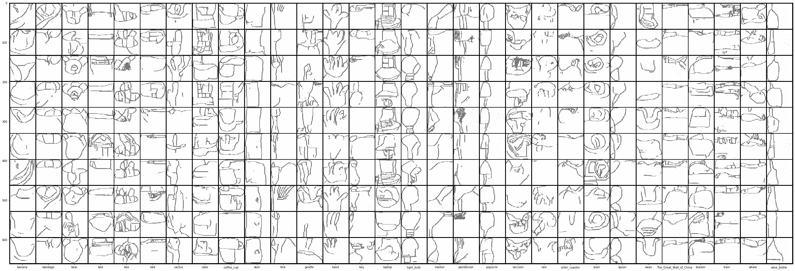

# hand_drawing_cDCGAN

## Objective
Condition GAN on [Google's hand drawing dataset](https://github.com/googlecreativelab/quickdraw-dataset).

---
## Model
Training via conditional DCGAN architecture, implemented by pytorch.

---
## Experiments
View the training process by the [nbviewer](https://nbviewer.jupyter.org/github/yenhao/hand_drawing_cDCGAN/blob/master/train.ipynb).

## Generated Images
---
The generated images for each class label are shown below:

TODO
---
- [ ] Save/load models
- [ ] Save generated images
- [ ] Convert to `.py` file
